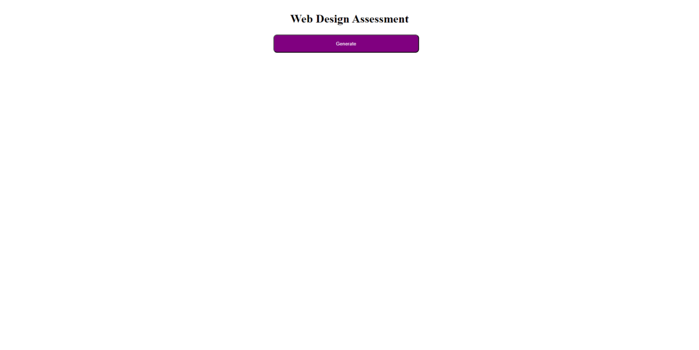
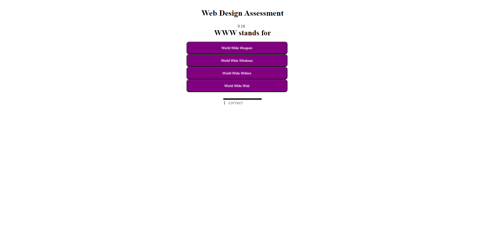
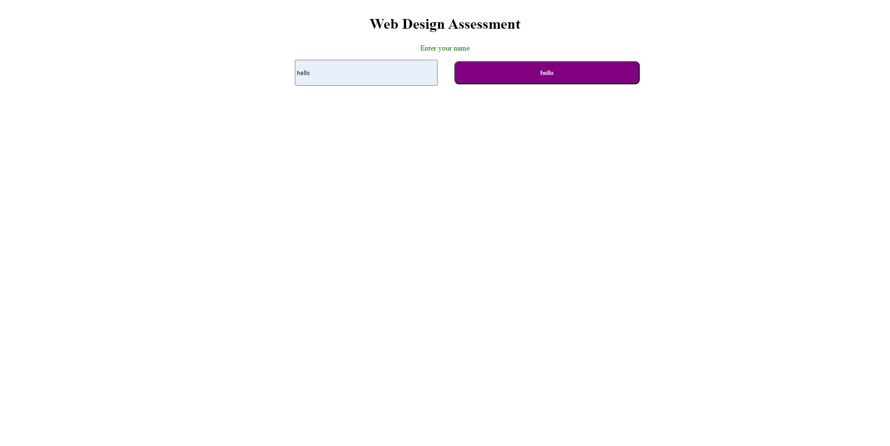
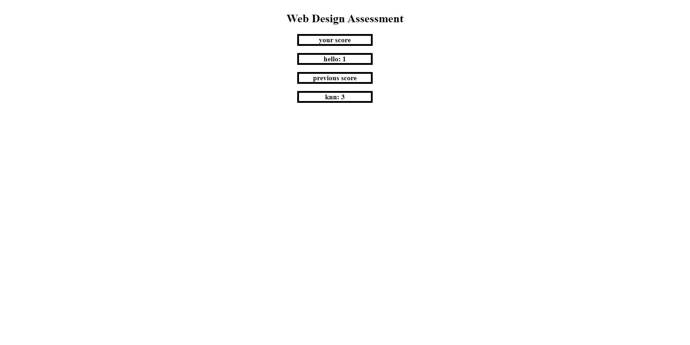

# Web Design Assessment 

# Description
A lot of javascript for this one. Jumping through the different functions was fun to make. manipulating the page through javascript was ok but manageable. all in all a decent learning experience.

## Installation
to insall this project, clone the repository from [github](https://github.com/b0n3yard/Web_Design_Assessment) and open index.html in the chrome browser. alternatively you can view the finished page [here](https://b0n3yard.github.io/Web_Design_Assessment/)

## Usage

<!-- 

 -->

## Credits
Michael Klein
and a lot of help from [W3schools](https://www.w3schools.com/js/default.asp)

Questions and answers sourced from [ProProfs Quizzes](https://www.proprofs.com/quiz-school/story.php?title=web-design-quiz_230d) and [StudytoSuccess.com](https://studytosuccess.in/web-designing-mcq/)

## Licence
